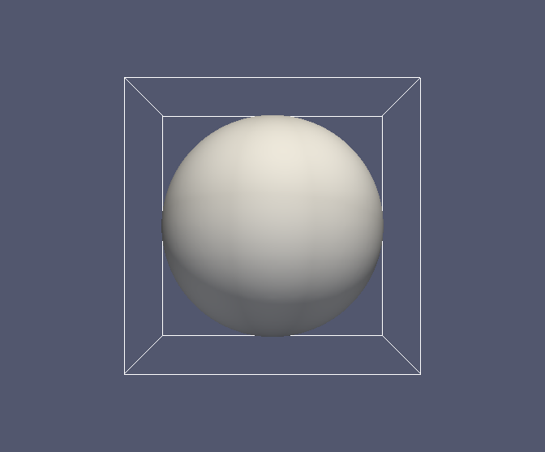

# CubismZ: A Parallel Data Compression Framework for Large Scale 3D Scientific Data


## Software design

CubismZ is a parallel framework for compression of 3D floating point datasets. 
It uses a block-structured layout, dividing the input dataset into a 3D grid of cubic blocks.
The grid can be decomposed into equal-sized subgrids and assigned to different MPI processes
which are organized in a 3D MPI cartesian grid topology.

CubismZ performs two compression stages on the input 3D datasets.  The first stage
makes use of (lossy) floating point compression algorithms.  In the second
stage, general-purpose lossless methods are applied to the compressed data of
the first stage.  A more detailed description can be found in the paper.

#### Substage 1: Floating point compression

Available compressors for this stage are:

- 3D wavelets ([CSELAB][linklab])
- FPZIP ([LLNL][linkllnl])
- ZFP ([LLNL][linkllnl])
- SZ ([ANL][linkanl])

#### Substage 2: General-purpose lossless compression

Available compression techniques for this stage are:

- [ZLIB][linkzlib]
- [LZ4][linklz4]

Before lossless compression, data (byte) shuffling and bit zeroing can be optionally applied to the output of the wavelet-based compression scheme.

#### External software dependencies

- MPI library (Tested platforms: MPICH, OpenMPI, MVAPICH2)
- Parallel HDF5 (Compatible with one of the above MPI libraries)  

## Code layout

- **Compressor:** source code of CubismZ
  - ***Cubism:*** a library for uniform block-structured grids
  - ***source:*** parallel framework and 3D wavelet-based compression

- **ThirdParty:** External software libraries 
  - ***build:*** where the third-party libraries are installed
  - ***fpzip:*** FPZIP (v 1.1.0) floating point compressor
  - ***lz4:*** LZ4 compression library
  - ***sz:*** SZ (v 1.4.11) floating point compressor
  - ***zfp:*** ZFP (v 0.5.0) floating point compressor
  - ***zlib:*** ZLIB (v 1.2.11) compression library
  
- **Tools:** source code for the CubismZ tools (`hdf2cz`, `cz2hdf`, `cz2diff`)
	- ***bin/dir:*** where the above tools are installed, according to their compile-time configuration
	- ***dir:*** *default*, *wavz_zlib*, *fpzip*, *zfp*, *sz* 

- **Tests** source code for the CubismZ tools (`hdf2cz`, `cz2hdf`, `cz2diff`)
	- ***Data:*** HDF5 files (demo.h5 (8 MB) and data_005000-p.h5 (512 MB))
	- ***Test1:*** location of the first demo test 
	- ***Test2:*** location of the second demo test 
	- ***Test1_cav:*** as before but for the larger dataset
	- ***Test2_cav:*** as before but for the larger dataset 

## Quick start

#### 1. Make sure that the prerequisite libraries are available

- MPI library
- Parallel HDF5 library 

#### 2. Configure the software

- Edit `CubismZ/Makefile` and set the following variables: 
   - `MPICXX`, `MPICC`: MPI-aware C++ and C compiler, respectively
   - `hdf-incdir`, `hdf-libdir`, `hdf-libs`: location and name of the parallel HDF5 library 

#### 3. Build the CubismZ tools

- Issue `make` within the `CubismZ` directory. This will
  1. configure and build the third-party libraries and install them into the `CubismZ/ThirdParty/build` directory. 
  2. build the CubismZ tools (`hdf2cz`, `cz2hdf`, `cz2diff`) for each of the basic configurations and put the executable into the corresponding subdirectories of the `CubimZ/Tools/bin` directory. 

#### 4. Execute the demo tests

- Enter the `Tests/Test1` directory and execute the script `./run_all.sh`. 

  - The script will perform tests of various compression schemes using an input HDF5 file (`CubismZ/Tests/Data/demo.h5`, 8MB, 128^3 floats).
  - The generated `run_all.txt` file contains the output for the main configurations of the compression tools, running them 
    on a single core (`mpirun -n 1` and `OMP_NUM_THREADS=1`).
  - The reported compression ratios and PSNR values must coincide with those reported in the reference output file `cselab_ref_run_all.txt`.
  - The `run_all.sh` script uses the `mpirun` command to launch the executable.
    Some systems might offer a different command for launching MPI applications (e.g. `srun` for SLURM).

- Enter the `Tests/Test2` directory and execute the script `./run_all.sh`. 

  - This test uses the wavelet-based scheme to first compress the `demo.h5` HDF5 file. It then decompress the output compressed file 
    (`tmp.cz`) and converts it back to the HDF5 format generating the `out.h5` and `out.xmf` files. 
  - The two HDF5 files (`demo.h5` and `out.h5`) must have the same file size. If visualized with Paraview, they depict almost identical images.

## Detailed compilation instructions


### Configured compilation

The default set of executables required to reproduce the included test cases
can be generated by invoking `make` in the root directory.

The `C++` and `C` MPI wrappers can be set using the `MPICXX` and `MPICC` variables in `CubismZ/Makefile`, respectively.
They default to `MPICXX=mpic++` and `MPICC=mpicc`. 

The software has been tested with the [GCC][gcclink], [Intel][intellink] and [Clang][clanglink] compilers.

OpenMP is enabled by default, except for the Clang compiler.  It can be enabled
for a Clang installation that supports OpenMP by passing `extra=-fopenmp` to
the `make` command.

In order to compile the software, a parallel build of the [HDF5](http://www.hdfgroup.org) library is required.
The path to the HDF5 `include` and `lib` directories can be specified using the `hdf-incdir` and
`hdf-libdir` variables respectively.  The name of the HDF5 library can be specified using the
`hdf-libs` variable. 

See the [Makefile](./Makefile) for further details.

Successful execution of the build chain generates a set of executables in the `CubismZ/Tools/bin` directory.
The configuration for these binaries is as follows:

##### No compression (default)

Converts the input file to the CZ format without data compression.  No special flags are
required for this build at compile time.  This target can be built individually
with:
```
make tools-custom
```
using the `CubismZ/Makefile`.

##### Wavelets and ZLIB

Generates a build using the CubismZ wavelet compression scheme for the first
compression stage (floating point compression) and applies [ZLIB][linkzlib] in
the second compression stage.  This target can be built individually
with:
```
make tools-custom dir=wavz_zlib wavz=1 zlib=1
```
using the `CubismZ/Makefile`.

##### ZFP

Generates a build using the [ZFP][linkllnl] floating point compressor for the
first compression stage.  No further compression is applied for the second
stage.  This target can be built individually
with:
```
make tools-custom dir=zfp zfp=1
```
using the `CubismZ/Makefile`.

##### FPZIP

Generates a build using the [FPZIP][linkllnl] floating point compressor for the
first compression stage.  No further compression is applied for the second
stage.  This target can be built individually
with:
```
make tools-custom dir=fpzip fpzip=1
```
using the `CubismZ/Makefile`.

##### SZ

Generates a build using the [SZ][linkanl] floating point compressor for the
first compression stage.  No further compression is applied for the second
stage.  This target can be built individually
with:
```
make tools-custom dir=sz sz=1
```
using the `CubismZ/Makefile`.

### Blocksize

The block dimension can be specified at compile time.  The default value is
`blocksize=32`, which translates to cubic blocks with `32 * 32 * 32` data
elements.  Its value must be a power of two.

### Precision

CubismZ tools can be compiled for compression of single and double precision datasets.
The precision can be specified at compile time.  The default value is
`precision=float` (single). Scientific datasets of doubles can be compressed
if CubismZ tools have been compiled with `precision=double`. 

The `CubismZ/Test/Data/demo_dp.h5` file is a double precision version of the demo dataset.


### Custom compilation

Custom user defined configurations are possible as well.  Any of the
combinations described in the [design](#software-design) section are possible.  Custom
builds are generated with the `tools-custom` rule defined in the
`CubismZ/Makefile`.  The following illustrates two examples how to compile a
custom build.  The `dir=` option sets the name of the directory in `Tools/bin`.
If it exists, its content will be overwritten.  The default is `dir=default`.

##### Wavelets, shuffling and ZLIB
```
make tools-custom dir=mycustom1 wavz=1 shuffle3=1 zlib=1
```

##### Wavelets and LZ4
```
make tools-custom dir=mycustom2 wavz=1 lz4=1
```

Additional compile time flags may be required for compiler specification, data
precision and HDF5 library paths.  See the [configured
compilation](#configured-compilation) section for more details.


## Runtime arguments of CubismZ tools for HDF5 datasets

### 1. The `hdf2cz` tool

Compression of HDF5 files to CZ format.
```
hdf2cz -h5file <hdf5 file> -czfile <cz file> -threshold <e> [-wtype <wt>] [-bpdx <nbx>] [-bpdy <nby>] [-bpdz <nbz>] [-nprocx <npx>] [-nprocy <npy>] [-nprocz <npz>]
```

#### Description of program arguments

- `-h5file <hdf5 file>`: the input HDF5 file to compress 
- `-czfile <cz file>`: the name of the output compressed file
- `-threshold <e>`: specifies how lossy the compression will be and depends on the lossy floating compressor used at the first substage of CubismZ. More specifically:
  - **Wavelets**: wavelets coefficients with *absolute value* smaller than the threshold are decimated.
  - **FPZIP**: denotes the number of useful bits of the floating point numbers (e.g. it must be equal to 32 for full accuracy of single precision datasets).
  - **ZFP**: specifies to the *absolute error* tolerance for fixed-accuracy mode.
  - **SZ**: the (de)compression error is limited to be within an *absolute error* defined by the specificed value.
- `-wtype <wt>`: wavelet type used by the corresponding compression scheme (if applied). The following options for wavelet types are supported:
  - **1**: 4th order interpolating wavelets
  - **2**: 4th order lifted interpolating wavelets
  - **3**: 3rd order average interpolating wavelets (default)

- `-bpdx <nbx>`, `-bdpy <nby>`, `-bdpz <nbz>`: number of 3D blocks per dimension (*x*, *y* and *z*) for **each MPI rank**. Their default value is 1.
- `-nprocx <npx>`, `-nprocy <npy>`, `-nprocz <npz>`: number of MPI processes per dimension (*x*, *y* and *z*) in the 3D MPI cartesian grid topology. Their default value is 1.

###### Notes
- The HDF5 file consists of `(npx * nbx) * (npy * nby) * (npz * nbz)` cubic blocks.
- Each MPI process has a local subgrid of `nbx * nby * nbz` blocks. 
- For the default compilation options each cubic block contains 32^3 floats.
- The total number of processes specified for the Cartesian grid (`npx * npy * npz`) must be equal to the number of processes created by the `mpirun` launcher.

### 2. The `ch2hdf` tool

Decompression of CZ files and conversion to HDF5 format
```
cz2hdf -czfile <cz file> -h5file <basename> [-wtype <wt>]
```

#### Description of program arguments
- `-czfile <cz file>`: the input compressed file in CZ format
- `-h5file <basename>`: the basename of the output HDF5 file and the corresponding xmf file.
   The output file `<basename>.h5` can be visualized with Paraview.
- `-wtype <wt>`: wavelet type used by the corresponding compression scheme (if applied). 

###### Notes
- The optional argument specified by `wtype` must agree with the type of wavelets used in the compressed file.
- Compile time options (`blocksize`, `precision`, compression scheme) must agree with those
  used for the compression phase.  See the [blocksize](#blocksize) and [precision](#precision) sections for
  more information.


### 3. The `cz2diff` tool

Decompress and compare two CZ files
```
cz2diff -czfile1 <cz file> [-wtype <wt>] -czfile2 <cz reference file>
```

#### Description of program arguments
- `-czfile1 <cz file1>`: compressed CZ file 
- `-czfile2 <cz reference file>`: reference CZ file, generated by the default configuration of the `hdf2cz` tool, i.e., without any [compression method enabled](#no-compression-default)
- `-wtype <wt>`: wavelet type used by the corresponding compression scheme (if applied). 

###### Notes
- Useful for quality assessment of the compression


## Example: Fluid dynamics data

#### Demo dataset

The software release includes a set of basic tests to demonstrate the
capabilities of the CubismZ compression techniques. The demo dataset (`demo.h5`) 
consists of a spherical bubble located at the center of the cubic domain
and discretized with `128 * 128 * 128` cells. 
The HDF5 file (8MB) is available in the `CubismZ/Tests/Data` directory.
A visualization of the single bubble is depicted below.




#### Compression performance tests

The compression performance tests are located in `CubismZ/Tests/Test1`.  The test
scripts require the simulation HDF5 data `demo.h5`, which is located in `CubismZ/Tests/Data`.

The complete test chain can be run by executing `CubismZ/Tests/Test1/run_all.sh`.  The
script requires that the [configured compilation](#configured-compilation) has
been performed previously.  The `run_all.sh` script generates a `run_all.txt`
file with the output of the compressor test configurations.
The script can be run with the syntax:
```
./run_all.sh [<n processors>]
```
where `<n processors>` is the number of MPI processes to be used.  The default
is 1.  Reference output from [CSELAB][linklab] can be found in
`cselab_ref_run_all.txt`.  The generated output is as follows (example based on
`test_wavz.sh`):
```
###############################################################################
RUNNING: test_wavz.sh
###############################################################################

RES:           CR   rel(e_inf)     rel(e_1)    mean(e_1)     rel(e_2)    mean(e_2)          BPS         PSNR
RES:       256.23 8.722263e-04 8.271610e-05 3.972721e-05 1.046102e-04 3.611734e-08       0.1249      78.2226
```
The reported numbers are compression ratio (`CR`), maximum errors in infinity,
L1 and L2 norms (`rel(e_inf)`, `rel(e_1)` and `rel(e_2)`) as well as mean
values for the L1 and L2 norms (`mean(e_1)` and `mean(e_2)`).  Finally,
bits-per-sample (`BPS`) and peak-signal-to-noise-ratio (`PSNR`) are computed.

The `run_all.sh` script executes the following tasks:

1. `genref.sh`: Generates a reference CZ file without compression, based on
   the HDF5 input data.  The script can also be executed individually with the
   syntax:
   ```
   ./genref.sh
   ```

2. `test_wavz.sh`: Runs the [wavelets and zlib](#wavelets-and-zlib) compressor.
   If no reference file exists, the script will generate it automatically.  The
   test can be run individually with the syntax:
   ```
   ./test_wavz.sh [<error threshold> [<n processors>]]
   ```
   Parameters in square brackets are optional.  The `<error threshold>`
   parameter is specific to the wavelet compressor.  `<n processors>` sets the number
   of MPI processes.  Defaults to 1 if not specified.  See [description of
   program arguments](#description-of-program-arguments) for more information.

3. `test_zfp.sh`: Runs the [ZFP](#zfp) compressor.  If no reference file
   exists, the script will generate it automatically.  The test can be run
   individually with the syntax:
   ```
   ./test_zfp.sh [<error threshold> [<n processors>]]
   ```
   Parameters in square brackets are optional.  The `<error threshold>`
   parameter is specific to the ZFP compressor.  `<n processors>` sets the number
   of MPI processes.  Defaults to 1 if not specified.  See [description of
   program arguments](#description-of-program-arguments) for more information.

4. `test_fpzip.sh`: Runs the [FPZIP](#fpzip) compressor.  If no reference file
   exists, the script will generate it automatically.  The test can be run
   individually with the syntax:
   ```
   ./test_fpzip.sh [<n bits> [<n processors>]]
   ```
   Parameters in square brackets are optional.  The `<n bits>`
   parameter is specific to the FPZIP compressor.  `<n processors>` sets the number
   of MPI processes.  Defaults to 1 if not specified.  See [description of
   program arguments](#description-of-program-arguments) for more information.

5. `test_sz.sh`: Runs the [SZ](#sz) compressor.  If no reference file exists,
   the script will generate it automatically.  The test can be run individually
   with the syntax:
   ```
   ./test_sz.sh [<error threshold> [<n processors>]]
   ```
   Parameters in square brackets are optional.  The `<error threshold>`
   parameter is specific to the SZ compressor.  `<n processors>` sets the number
   of MPI processes.  Defaults to 1 if not specified.  See [description of
   program arguments](#description-of-program-arguments) for more information. The SZ
   compressor can be further configured using the provided
   `CubismZ/Tests/Test1/sz.config` file.

The performance metrics (compression ratio, errors, PSNR value) are written to
the standard output or into the file `run_all.txt` if the batch script is used.
The PSNR value is computed based on the reference CZ file generated with the
`genref.sh` script.

The default error threshold in each script has been adjusted so that the resulting PSNR is in the range of 75 to 78 dB. 
 
##### Testing custom builds

Custom builds can be tested against the reference using the `test_custom.sh`
script.  The execution syntax for this script is:
```
./test_custom.sh <path to binaries> <error threshold> [<n processors>]
```
where

* `<path to binaries>`: Path to the directory that contains the custom build.
  For example, if `dir=mycustom` has been passed to the `make` command, the
  path is `../../Tools/bin/mycustom` (assuming the current working directory is
  `CubismZ/Tests/Test1`.

* `<error threshold>`: Error threshold that corresponds to the chosen floating
  point compressor (substage1 compressor).  See [description of
   program arguments](#description-of-program-arguments) for more information.

* `<n processors>`: Number of MPI processes to be used.  Optional, defaults to 1.

#### Visual assessment for lossy compressors

An example of compression and decompression cycle is provided in `CubismZ/Tests/Test2`.
The `run_all.sh` script can be executed to run the test chain.
The script can be run with the syntax:
```
./run_all.sh [<n processors>]
```
where `<n processors>` is the number of MPI processes to be used.  The default
is 1.  The input HDF5 data is compressed to the CZ format using the `hdf2cz`
tool with wavelets and ZLIB compression substages.  The compressed data is then
converted back to HDF5 using the `cz2hdf` tool and can be used for
visualization using a capable tool such as Paraview, for example.

#### Cloud caviation collapse dataset

The software release includes an additional dataset that can be optionally used 
for testing the compression capabilities of CubismZ.  The test data consists of
the 3D pressure field of a cloud cavitation collapse simulation.  The initial
configuration is composed of 70 air bubbles (dispersed phase, non-condensible
gas) submerged in liquid water (continuous phase) and is discretized in a cubic
domain with `512 * 512 * 512` cells (single precision floating point numbers).
Note that the simulation is under-resolved.  Nevertheless, the degree of variation
in the quantity of interest (3D pressure field) is sufficient to test the compression algorithms. The snapshot of the test data is taken at iteration 5000.
A visualization of the gas volume fraction as well as the pressure in a plane through
the cloud center for this iteration is shown below.


Additionally, the mean pressure over all iteration steps is shown in the next
figure.  Plus/minus one standard deviation is indicated by the shaded region.


The pressure test data (`data_005000-p.h5`) at iteration 5000 can be found in the `CubismZ/Tests/Data` directory. The corresponding tests are located in the `CubismZ/Tests/Test1_cav` and `CubismZ/Tests/Test2_cav` directories. 

##### Running the cavitation data tests

- Execute the script `run_all.sh` in the `CubismZ/Tests/Test1_cav` and `CubismZ/Tests/Test2_cav` directories, following the steps for the demo tests.  


[linklab]:http://www.cse-lab.ethz.ch "http://www.cse-lab.ethz.ch"
[linkllnl]:https://computation.llnl.gov/projects/floating-point-compression "https://computation.llnl.gov/projects/floating-point-compression"
[linkanl]:https://collab.cels.anl.gov/display/ESR/SZ "https://collab.cels.anl.gov/display/ESR/SZ"
[linkzlib]:https://zlib.net/ "https://zlib.net/"
[linklz4]:https://lz4.github.io/lz4/ "https://lz4.github.io/lz4/"
[gcclink]:https://gcc.gnu.org/ "https://gcc.gnu.org/"
[intellink]:https://software.intel.com/en-us/c-compilers "https://software.intel.com/en-us/c-compilers"
[clanglink]:http://www.llvm.org/ "http://www.llvm.org/"
<!---->
